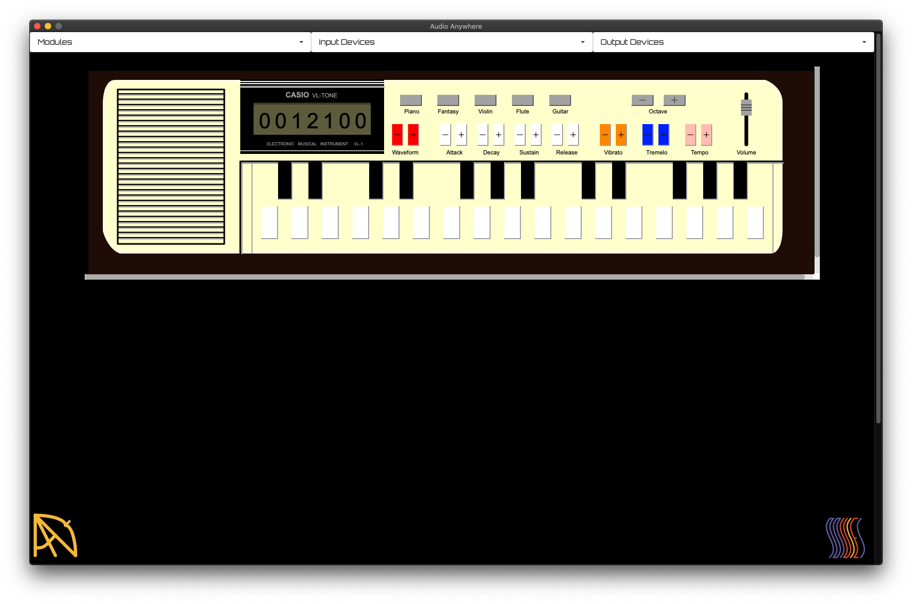

# About

This repo is part of a larger project called Audio Anywhere(AA). Audio Anywhere a 
framework for working with audio plugins that are compiled once and run anywhere.
At the heart of Audio Anywhere is an audio engine whose Digital Signal Processing (DSP) components are written in Faust and deployed with WebAssembly. 

Details about the project can be found on the [project's homepage](https://muses-dmi.github.io/projects/).

## Introduction



This repo contains a number of AA module examples. 

* [Default](https://github.com/bgaster/aa_examples/tree/master/default) is a do nothing module that can be loaded, well to do nothing
* [Nuke](https://github.com/bgaster/aa_examples/tree/master/nuke) is an analogue synth based on one of the Muses instruments
* [VL1](https://github.com/bgaster/aa_examples/tree/master/vl1) is a fairly close emulation of the [Casio VL-1](https://en.wikipedia.org/wiki/Casio_VL-1). (Audio Anywhere standalone version pictured above.)
* [Gain](https://github.com/bgaster/aa_examples/tree/master/gain) is a simple gain controller
* [Reflect](https://github.com/bgaster/aa_examples/tree/master/reflect) is a spring reverb emulation
* [Muses Synth](https://github.com/bgaster/aa_examples/tree/master/muses) is the Muses Synth, which consists of the Nuke synth followed by Reflect reverb. This example demostrates Audio Anywhere audio graphs, where each DSP is a seperate WASM, but there is single UI.
* More in development

## Building

The example audio components are mostly implmented in  [Rust](https://www.rust-lang.org/) and compiled to [WebAssembly](https://webassembly.org/). (Although it is planed to implemented at
least one using C/C++.)

They currenlty make use of features only on nightly.

To install Rust go you need simply to install [Rustup](https://rustup.rs/) and 
if you already have Rust installed, then you can update with the command rustup update.

Now you need to install nightly:

```bash
rustup toolchain install nightly
```
Don't forget to update if you already have nightly installed. Now install the WASM target:

```bash
rustup target add wasm32-unknown-unknown --toolchain nightly
```

Each of the examples have a Cargo config that automatically compiles to WASM. (Later sections detail how to create your own example.)

Most interfaces are written in HTML5, with pure Javascript. To build some of the GUIs into a single HTML file [Node.js](https://nodejs.org/en/) is required.

All that said there is no requirement that each module is implemented in the same fashion, and as such to build a particular module see the corresponding readme in its directory.

# Module Bundles

An AA module must consist of the following:

* **module.json** is a description of the module, which is used to load it.
* **module.wasm** is an AA WASM API conforming module that implements the audio part of a module.
* **module.html** (optional) UI implemented in HTML5.

# Deploying a set of Audio Anywhere Modules

It is possible to deploy AA modules in a number of different forms, but currently the 
[standalone application](https://github.com/bgaster/aa_standalone) and VST 2.x plugin take basically the same approach. They assume that the modules are served via a websever, which
for now requires that it is a single server, but this is not necessary. The root of the web-server contains the files in the directory **root** (it additionally contains some resources files):

* **index.html** code for the single page app of the interface;          
* **modules.json** description of example modules that can be loaded;
* **js** Javascript files loaded by **index.html** and also by AA modules;
* **css** CSS loaded by **index.html**.

When a AA hosting application runs its interface is populated with **index.html**,
and the set of modules is added to its module menu, which can be selected and loaded 
by the user. Additionally, a default module is loaded, as specified in **modules.json**.

Each module is assumed to have its own directory under the server root and contains the 
module bundle, as defined above.

A release can be built of existing AA modules and the AA hosting pages with the command:

```bash
./scripts/package.sh
```

This will create a directory, **pkg**, containing all the root files, plus bundles for each module in corresponding directories.

# Adding a Module

TODO

Once an example is implemented the following steps must be completed to ensure that is added correctly to a release:

* Add the module to **modules.json** so that a hosting application knows about the module;
* Add comamnds to copy the module bundle to **package.sh** so it is added when building a release.

# License

© 2020 [Benedict R. Gaster (cuberoo_)](https://bgaster.github.io/)

Licensed under either of

 * Apache License, Version 2.0
   ([LICENSE-APACHE](LICENSE-APACHE) or http://www.apache.org/licenses/LICENSE-2.0)
 * MIT license
   ([LICENSE-MIT](LICENSE-MIT) or http://opensource.org/licenses/MIT)

at your option.

## Contribution

Unless you explicitly state otherwise, any contribution intentionally submitted
for inclusion in the work by you, as defined in the Apache-2.0 license, shall be
dual licensed as above, without any additional terms or conditions.
